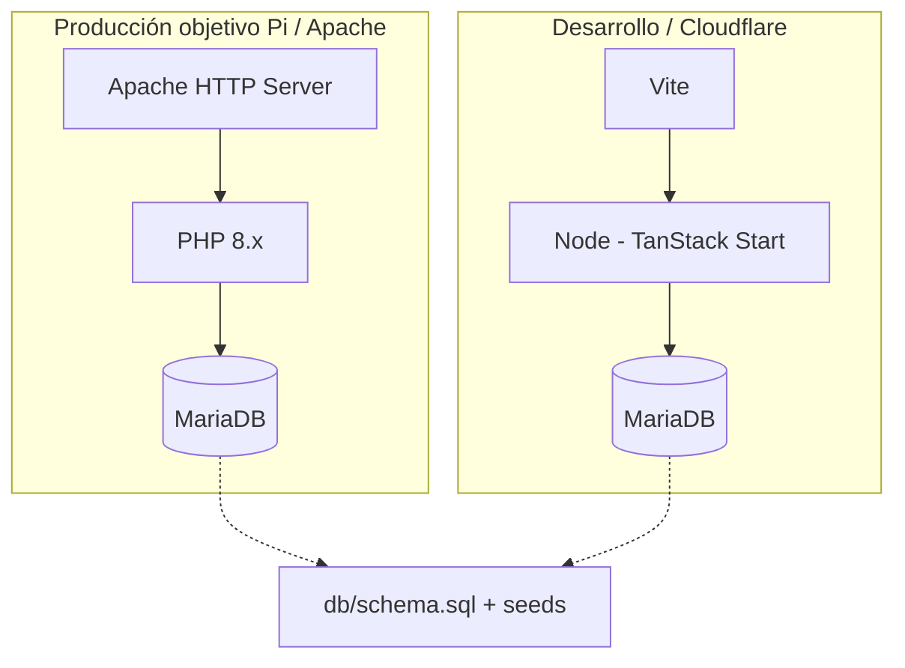

# Cenít Pi (ShopSmart Suite)

Marketplace e-commerce inspirado en Amazon: catálogo, carrito, checkout, roles (cliente / vendedor / admin) y asistente de vendedor en demo. El repositorio combina **dos formas de ejecutar el producto** sobre la misma base de datos MariaDB recomendada (`shopsmart`).

| Enfoque | Ubicación | Uso típico |
|--------|-----------|------------|
| **PHP + Apache** (sin Node en producción) | [`www/`](./www/) | Raspberry Pi, hosting compartido, VPS con LAMP |
| **React + TanStack Start** (Node + Vite) | [`src/`](./src/) | Desarrollo local con HMR, despliegue Cloudflare Workers o Node detrás de proxy |

La documentación técnica detallada y el historial de decisiones viven en [`docs/system.md`](./docs/system.md). El PRD original está en [`docs/prd.md`](./docs/prd.md).

---

## Tabla de contenidos

1. [Arquitectura general](#1-arquitectura-general)  
2. [Estructura del repositorio](#2-estructura-del-repositorio)  
3. [Base de datos MariaDB](#3-base-de-datos-mariadb)  
4. [Aplicación PHP (`www/`)](#4-aplicación-php-www)  
5. [Aplicación React (`src/`)](#5-aplicación-react-src)  
6. [Requisitos y herramientas](#6-requisitos-y-herramientas)  
7. [Variables de entorno](#7-variables-de-entorno)  
8. [Puesta en marcha](#8-puesta-en-marcha)  
9. [Flujos de trabajo](#9-flujos-de-trabajo)  
10. [Scripts npm](#10-scripts-npm)  
11. [Calidad de código y convenciones](#11-calidad-de-código-y-convenciones)  
12. [Despliegue](#12-despliegue)  
13. [Estado de funcionalidades](#13-estado-de-funcionalidades)  
14. [Documentación adicional](#14-documentación-adicional)

---

## 1. Arquitectura general



- **Capa de datos:** MariaDB (tablas `categories`, `products`, `users`, `orders`, `order_items`, `cart_items`, etc. según [`db/schema.sql`](./db/schema.sql)).  
- **Capa PHP:** páginas `.php`, controladores y modelos con **PDO**, sesiones PHP para login y carrito en sesión.  
- **Capa Node/React:** SSR y *server functions* (`createServerFn`) para catálogo; el cliente usa React Query, router file-based y estado local (`localStorage`) para carrito/auth según rutas.

Los dos stacks pueden apuntar a la **misma** base `shopsmart` si las variables de entorno de Node y las credenciales PHP coinciden.

---

## 2. Estructura del repositorio

```
shopsmart-suite/
├── www/                      # App PHP (copiar a DocumentRoot en Apache)
│   ├── bootstrap.php         # Sesión, autoload, config
│   ├── config/               # app.php (APP_NAME, e()), db.php (PDO)
│   ├── controllers/          # Home, Products, ProductDetail
│   ├── models/               # Category, Product, User, SellerAssistantSimulator
│   ├── components/           # header.php, footer.php
│   ├── views/                # Plantillas por página + partials
│   ├── assets/css|js/        # app.css, app.js (menú móvil)
│   ├── *.php                 # Entradas: index, login, products, cart, seller-ai-assistant, …
│   └── .htaccess
├── src/                      # SPA/SSR React + TanStack
│   ├── routes/               # Rutas file-based (__root, index, products, …)
│   ├── backend/              # mysql2, catalog.server.ts, auth (solo servidor)
│   ├── lib/                  # auth, cart, catalog-resolve, …
│   ├── components/           # UI + shadcn en components/ui/
│   ├── server.ts / start.ts / router.tsx
│   └── styles.css            # Tokens Tailwind v4 / OKLCH
├── db/                       # Esquema y seeds alineados con PHP + Docker
│   ├── schema.sql
│   ├── seed.sql
│   ├── seed-products-generated.sql
│   └── generate-seed-products.mjs   # Node: regenera SQL de productos
├── database/                 # Migración SQL alternativa (forma de tablas distinta)
│   └── migrations/001_initial.sql
├── docs/
│   ├── prd.md
│   ├── system.md             # Estado del sistema (documento vivo)
│   └── deploy-mariadb-apache.md
├── cursor/                   # Reglas Cursor (.mdc) para el agente
├── public/                   # Estáticos servidos por Vite
├── docker-compose.yml        # MariaDB 11 + init desde db/*.sql
├── package.json
├── vite.config.ts
├── wrangler.jsonc            # Opcional: Workers
├── components.json           # shadcn/ui
├── server.js                 # Express opcional (script server:express)
└── .env.example
```

---

## 3. Base de datos MariaDB

### Esquema principal para PHP y Docker: `db/`

- [`db/schema.sql`](./db/schema.sql): crea la base **`shopsmart`**, `categories` con **clave primaria `slug`**, `products` con `category_slug` como FK, usuarios, pedidos, etc.  
- [`db/seed.sql`](./db/seed.sql): categorías y usuarios demo.  
- [`db/seed-products-generated.sql`](./db/seed-products-generated.sql): productos de ejemplo.  
- **Docker:** `docker-compose.yml` monta esos tres archivos en `/docker-entrypoint-initdb.d/` para inicializar el contenedor automáticamente.

### Migración alternativa: `database/migrations/`

- [`database/migrations/001_initial.sql`](./database/migrations/001_initial.sql): otro diseño de tablas (p. ej. categorías con `id` autoincrement). Úsalo solo si adaptas consumidores; **los modelos PHP actuales esperan el esquema de `db/schema.sql`**.

### Regenerar catálogo de productos (solo máquina de desarrollo con Node)

```bash
node db/generate-seed-products.mjs
```

Vuelca SQL coherente con el catálogo de referencia; revisa el propio script para rutas de salida.

---

## 4. Aplicación PHP (`www/`)

| Concepto | Detalle |
|----------|---------|
| Entrada | Cada URL es un script (`index.php`, `products.php`, …) que incluye `bootstrap.php`. |
| MVC ligero | `controllers/*` orquestan; `models/*` encapsulan PDO; `views/*` renderizan HTML. |
| Seguridad salida | Función global `e()` para escapar HTML. |
| Auth | `User::attemptLogin` con `password_verify`; sesión en `$_SESSION['user']`. |
| Carrito | `$_SESSION['cart']` y `cart_count` (no sincronizado aún con tabla `cart_items`). |
| Vendedor | `seller.php`; **Asistente IA (demo)** en `seller-ai-assistant.php` + `SellerAssistantSimulator` (respuestas por plantillas, sin API externa). |

**Producción:** copia el contenido de `www/` al `DocumentRoot` de Apache (p. ej. `/var/www/html/`). Configura `SetEnv` para credenciales (ver [Variables de entorno](#7-variables-de-entorno)).

**Desarrollo rápido sin Apache:**

```bash
cd www
export DB_HOST=127.0.0.1 DB_NAME=shopsmart DB_USER=root DB_PASS=devroot
php -S localhost:8080
```

En Windows PowerShell usa `$env:DB_PASS="..."` antes de `php -S`.

> La app PHP lee la contraseña como **`DB_PASS`** ([`www/config/db.php`](./www/config/db.php)), no `DB_PASSWORD`.

---

## 5. Aplicación React (`src/`)

| Concepto | Detalle |
|----------|---------|
| Framework | TanStack Start + TanStack Router (rutas en `src/routes/`). |
| UI | React 19, Radix + componentes tipo shadcn en `src/components/ui/`, Tailwind CSS 4. |
| Datos | TanStack Query; catálogo desde MariaDB vía funciones servidor en `src/backend/` (`mysql2`). |
| Resolución catálogo | `catalog-resolve.ts` + contexto en `__root.tsx`; fallback a datos estáticos si no hay BD o tablas vacías. |
| Auth / carrito (SPA) | Mucha lógica sigue en `localStorage` (claves históricas `picommerce.*`); ver `docs/system.md`. |

**Desarrollo:**

```bash
npm install
npm run dev
```

**Build:** `npm run build` (configuración compatible con plugin Cloudflare en build).

**Importante:** el código que solo debe ejecutarse en servidor (MariaDB) debe vivir bajo **`src/backend/`**, no bajo rutas que el bundler bloquee para el cliente (ver comentarios en `docs/system.md`).

---

## 6. Requisitos y herramientas

| Herramienta | Para qué |
|-------------|----------|
| **Node.js 22+** (recomendado) | `npm run dev`, build, script de seeds, ESLint |
| **npm** | Gestor principal (`package-lock.json`) |
| **Docker + Docker Compose** | MariaDB local (`npm run db:up` / `dev:stack`) |
| **PHP 8.x** + extensión **pdo_mysql** | Ejecutar `www/` |
| **Apache** (opcional en dev) | Producción PHP o proxy a Node |
| **MariaDB 10.5+ / 11** | Base de datos |
| **Git** | Control de versiones |

Opcionales: **Bun** (`bun.lock` presente), **Wrangler** para despliegue Cloudflare, **Prettier / ESLint** ya definidos en el repo.

---

## 7. Variables de entorno

Copia [`.env.example`](./.env.example) a `.env` (no lo subas al repositorio).

### Node / Vite / TanStack (archivo `.env` en la raíz)

Leídas en servidor vía `dotenv` en [`src/backend/db/env.ts`](./src/backend/db/env.ts):

- `DATABASE_URL` **o** `DB_HOST`, `DB_PORT`, `DB_USER`, `DB_PASSWORD`, `DB_NAME`.  
- Ejemplo coherente con Docker del repo: `DB_NAME=shopsmart`, `DB_PASSWORD=devroot`, `DB_HOST=127.0.0.1`.

### PHP (`www/config/db.php`)

- `DB_HOST`, `DB_NAME`, `DB_USER`, **`DB_PASS`** (nombre distinto a Node).  
- Opcional: `APP_NAME`, `BASE_URL`.

En Apache puedes definir `SetEnv DB_PASS ...` en el VirtualHost.

---

## 8. Puesta en marcha

### Opción A — Todo en local con Docker + React

1. Clona el repo e instala dependencias: `npm install`.  
2. Crea `.env` con al menos `DB_HOST`, `DB_USER`, `DB_PASSWORD`, `DB_NAME` alineados a `docker-compose.yml` (p. ej. `DB_PASSWORD=devroot`, `DB_NAME=shopsmart`).  
3. Arranca la base y espera a que esté sana:

   ```bash
   npm run db:up
   ```

4. Arranca la app con base ya levantada:

   ```bash
   npm run dev:stack
   ```

   O en dos terminales: `npm run db:up` y luego `npm run dev`.

### Opción B — Solo PHP + MariaDB ya existente

1. Importa `db/schema.sql` y los `seed*.sql` con el cliente `mysql`/`mariadb`.  
2. Configura credenciales (`DB_*` / `DB_PASS` para PHP).  
3. Sirve la carpeta `www/` con Apache o `php -S` como arriba.

### Login PHP y hashes

`User::attemptLogin` usa **`password_verify`**. Los hashes del seed deben ser compatibles (p. ej. **`password_hash` en PHP con `PASSWORD_DEFAULT`**). Si el seed trae otro algoritmo, el login PHP fallará hasta que actualices los hashes en `users`.

---

## 9. Flujos de trabajo

### Desarrollador frontend (React)

1. `npm run dev` (o `dev:stack` con Docker).  
2. Editar rutas en `src/routes/`; el árbol `routeTree.gen.ts` se regenera en dev.  
3. Estilos: tokens en `src/styles.css`; utilidades Tailwind en componentes.  
4. Catálogo servidor: ampliar `src/backend/db/catalog-repository.ts` y funciones en `catalog.server.ts` si añades endpoints de datos.

### Desarrollador PHP / Pi

1. Trabajar en `www/*.php`, `views/`, `models/`.  
2. Probar contra MariaDB con los mismos datos que `db/seed*.sql`.  
3. Subir cambios con `rsync`/git pull en el servidor y recargar Apache.

### Datos

1. Cambios de esquema: nuevo archivo SQL versionado y actualización de `docs/system.md` + migraciones aplicadas en cada entorno.  
2. Productos demo: `node db/generate-seed-products.mjs` y commit del SQL generado si procede.

---

## 10. Scripts npm

| Script | Descripción |
|--------|-------------|
| `npm run dev` | Servidor Vite (HMR + SSR TanStack). |
| `npm run dev:stack` | Docker Compose (MariaDB) en espera + `vite dev`. |
| `npm run db:up` / `db:down` | Levanta / baja solo el contenedor MariaDB. |
| `npm run build` | Build de producción. |
| `npm run build:dev` | Build en modo development. |
| `npm run preview` | Previsualiza el artefacto de build. |
| `npm run lint` | ESLint. |
| `npm run format` | Prettier en el repo. |
| `npm run server:express` | Servidor Express opcional (`server.js`). |

---

## 11. Calidad de código y convenciones

- **ESLint 9** (flat config) + **Prettier** — ver `eslint.config.js`, `.prettierrc`.  
- **TypeScript** estricto en el front — ver `tsconfig.json`.  
- Reglas orientativas para IA/humanos en **`cursor/*.mdc`** (React, TypeScript, Tailwind).  
- **shadcn/ui:** no editar a mano de forma arbitraria `src/components/ui/*`; preferir CLI según `components.json`.  
- **PHP:** `declare(strict_types=1);`, PDO preparado, sin mezclar lógica pesada en vistas si puede ir al modelo/controlador.

---

## 12. Despliegue

- **PHP en Raspberry Pi / Apache:** copiar `www/`, virtual host, `SetEnv` para BD, extensiones PHP necesarias. Ver también [`docs/deploy-mariadb-apache.md`](./docs/deploy-mariadb-apache.md) (orientado a **Node detrás de Apache**; adaptable si solo sirves PHP).  
- **Node / TanStack en servidor:** proceso Node (systemd, pm2) + variables de entorno + proxy reverso desde Apache/Nginx.  
- **Cloudflare Workers:** `wrangler.jsonc` + `npm run build` según la guía del proveedor.

---

## 13. Estado de funcionalidades

Área | PHP `www/` | React `src/` |
|------|------------|--------------|
| Catálogo / detalle / filtros | Implementado (GET, PDO) | Implementado + BD opcional |
| Carrito | Sesión | `localStorage` |
| Checkout / órdenes | Placeholders | UI + persistencia local |
| Login | Sesión + BD | Simulado / local |
| Registro | Placeholder | UI |
| Admin / seller CRUD | Placeholders | UI mock en parte |
| Asistente vendedor (título, descripción, precio, categoría) | Demo simulada (`SellerAssistantSimulator`) | — |

Para el detalle fino y el historial de cambios, **`docs/system.md`**.

---

## 14. Documentación adicional

| Archivo | Contenido |
|---------|-------------|
| [`docs/system.md`](./docs/system.md) | Arquitectura dual, rutas PHP, discrepancia `db/` vs `database/`, diseño, brechas, historial. |
| [`docs/prd.md`](./docs/prd.md) | Visión de producto y MVP. |
| [`docs/deploy-mariadb-apache.md`](./docs/deploy-mariadb-apache.md) | Apache + MariaDB + Node en Pi. |

---

## Licencia y privacidad

El campo `"private": true` en `package.json` indica que el paquete npm no está pensado para publicarse en el registro público. Ajusta la licencia del repositorio según la política de tu organización.
